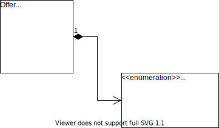

# Architecture / conception

Le module est une application de type web conçue à l'aide des technologies suivantes :

* [Node.js](https://nodejs.org/) Services web backend
* [MariaDB](https://mariadb.org/) Serveur de base de données pour le stockage des données coté serveur
* [Vue.js](https://vuejs.org/) Framework Javascript de l'interface utilisateur (poste client)
* [Bootstrap](https://getbootstrap.com/) Framework de présentation pour l'interface utilisateur

## Modèle de données

### La bourse aux équipiers

### Les comptes utilisateurs

