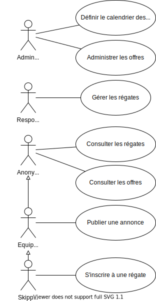

# Expression du besoin

L'application _Module web de gestion des régates_ doit permettre aux différents acteurs faisant partie du G.C.I. :

* de mettre en relation les équipiers souhaitant embarquer avec les skippers proposant des embarquements
* de définir le calendrier des régates
* de s'inscrire aux régates
* de gérer les inscriptions à une régate
* d'administrer les activités précédentes

Les acteurs sont donc les suivants :

* l'_administrateur_ est une personne du G.C.I. qui a en charge l'administration du module ainsi que la création du calendrier des régates
* le _responsable de club_ doit définir les régates (notament publier l'avis de course et les instructions de course), gérer les inscriptions aux régates puis enfin publier les résultats
* le _skipper_ peut publier des offres d'embarquement sur la bourse des équipiers et s'inscrire à des régates
* l'_équipier_ peut publier des demandes d'embarquement sur la bourse des équipiers
* l'utilisateur _anonyme_ peut consulter les offres et demandes d'embarquement et consulter les régates

On distingues deux types d'utilisateur du site :

* les utilisateurs authentifiés qui doivent se connecter pour avoir accès à un certain nombre de fonctions spécialisés
* les utilisateurs anonymes (non authentifiés) qui peuvent réaliser des actions qui ne requiert pas de connection